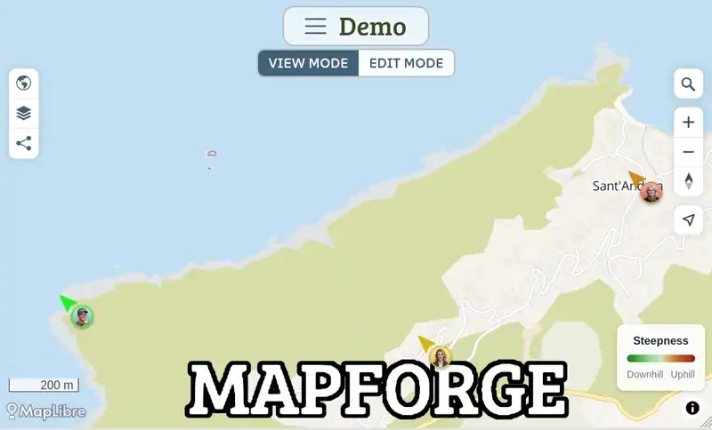

<!--  -->

# Mapforge

**[Try it on mapforge.org](https://mapforge.org)** · [Self-host](SELF-HOSTING.md) · [Changelog](CHANGELOG.md) · [Contributing](CONTRIBUTING.md)

Create individual maps for your places, tracks and events, and share them in real time.

 *See the demo map [here](https://mapforge.org/m/3799d512/Demo%20Map)*

Mapforge is an open source GIS web application. Create and share your places, tracks and events as GeoJSON layers on different base maps, with [MapLibre GL JS](https://maplibre.org/maplibre-gl-js/docs/) on desktop and mobile. Changes are synced live to all clients.

## Features

### Map and data

- Create maps with your own data on top of various available base maps.
- 3D terrain, hillshade, contour lines and globe projection
- Draw shapes and [style them](https://mapforge.org/doc/geojson_style_spec): Add pictures, customize colors, symbols, labels, (3D) polygons, indoor maps and more. The style attributes extend the [GeoJSON](https://macwright.com/2015/03/23/geojson-second-bite.html) / [Mapbox simplestyle](https://github.com/mapbox/simplestyle-spec/tree/master/1.1.0) spec.
- Import and export GeoJSON, GPX and KML
- Search places and addresses, including the features of the open map
- [Integration](https://mapforge.org/doc/overpass_layers) with [Overpass API](https://wiki.openstreetmap.org/wiki/Overpass_API/Overpass_QL) for custom OpenStreetMap queries

### Routing

- Plan routes for walking, bike and car with [openrouteservice](https://openrouteservice.org/), with elevation profile and route color coding by steepness or surface

### Collaboration and sharing

- Real-time collaborative editing, changes sync to every connected client over WebSockets
- Share maps and embed on your own web page

### Apps and platforms

- Desktop and mobile UI
- [PWA support](docs/tutorials/app.md) by default, ships as an [Android app](https://play.google.com/store/apps/details?id=org.mapforge.twa) via Bubblewrap
- Record GPS tracks with the built in [µlogger API](engines/ulogger/README.md)
- Login with Google, GitHub or OSM OAuth, no auth system to maintain

### Privacy and self-hosting

- [Self-host](SELF-HOSTING.md) with ready-to-use Docker Compose file
- No ads and no tracking

## How Mapforge compares

|                                      | Mapforge                         | [uMap][umap]                 | [Google My Maps][mymaps]     | [Felt][felt]             |
| ------------------------------------ | -------------------------------- | ---------------------------- | ---------------------------- | ------------------------ |
| License                              | AGPL v3                          | AGPL v3                      | proprietary                  | proprietary              |
| Self-hosting                         | yes, Docker Compose              | yes                          | no                           | no                       |
| Real-time collaboration              | yes                              | yes, opt-in                  | through account sharing      | yes                      |
| Vector base maps, 3D terrain, globe  | yes                              | no, Leaflet 2D               | no                           | no                       |
| Routing with elevation profile       | yes, with [ORS key][ors-key]     | no                           | directions only              | no                       |
| Import formats                       | GeoJSON, GPX, KML                | CSV, GeoJSON, GPX, KML, OSM  | CSV, XLSX, KML, GPX, Sheets  | Shapefile, GeoTIFF, CSV  |
| Spatial analysis (buffers, joins)    | no                               | no                           | no                           | yes                      |
| Icon markers                        | yes, emoji + [Pinhead][pinhead]  | yes, icon symbol field       | no, icon images only         | yes                      |
| Photo upload                         | yes, max 5 MB                    | no, image URL only           | yes                          | yes, with EXIF position  |
| Live GPS track recording             | yes, [µlogger API][ulogger]      | no                           | no                           | yes, field app           |
| Mobile app                           | PWA and Android app              | responsive web only          | view only, no edit           | iOS and Android          |
| Interface languages                  | English, German                  | 47 languages                 | Google account language      | English                  |

## Development

Mapforge is a Ruby on Rails 8 application. It uses Mongoid on MongoDB for persistence, Redis and Action Cable for live sync, and Importmap with Turbo and Stimulus for the frontend. The map uses MapLibre GL JS, mapbox-gl-draw for drawing and Turf.js for geometry calculations.

- [DEVELOPMENT.md](DEVELOPMENT.md) explains the local setup.
- [CONTRIBUTING.md](CONTRIBUTING.md) explains the workflow for bug reports, code and translations.
- [GitHub Discussions](https://github.com/mapforge-org/mapforge/discussions) is the place for questions and ideas.

## License

Mapforge uses the [AGPL v3](LICENSE) license. See [THIRD-PARTY-LICENSES.md](THIRD-PARTY-LICENSES.md) for the licenses of the bundled open source projects.

[umap]: https://umap-project.org/
[mymaps]: https://www.google.com/mymaps
[felt]: https://felt.com/
[ors-key]: SELF-HOSTING.md#map-and-routing-service-keys
[pinhead]: https://github.com/waysidemapping/pinhead
[ulogger]: https://mapforge.org/doc/ulogger
